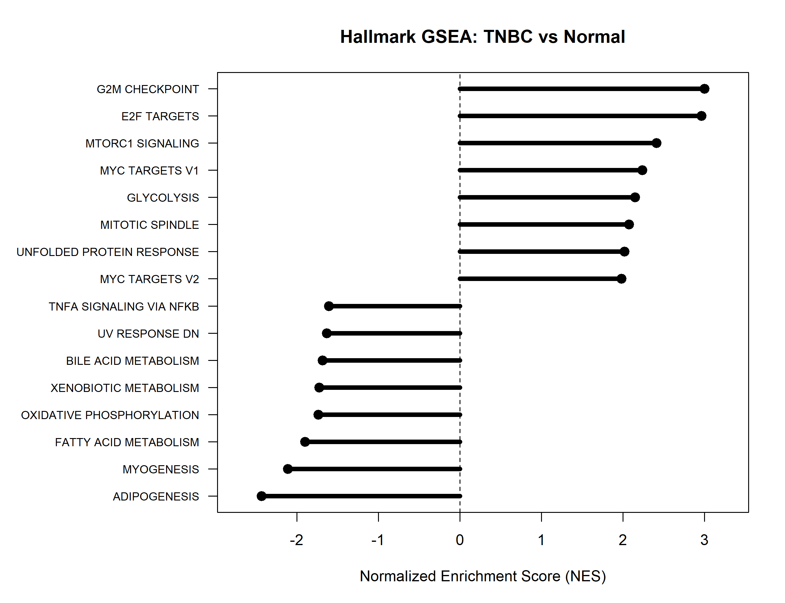
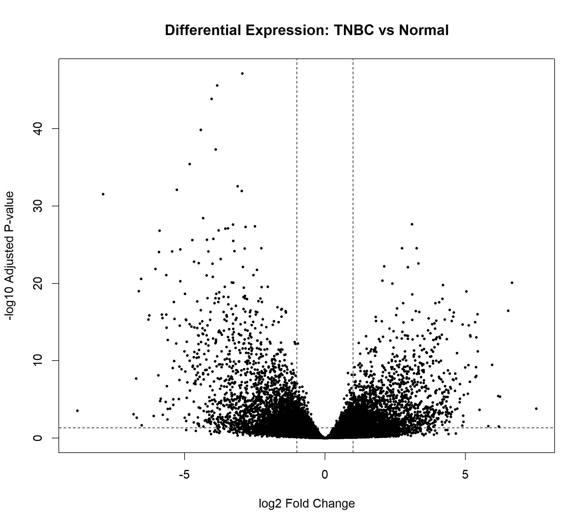
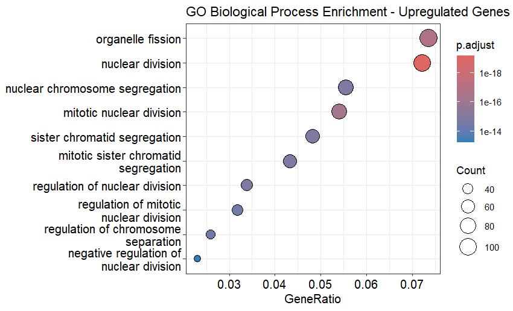
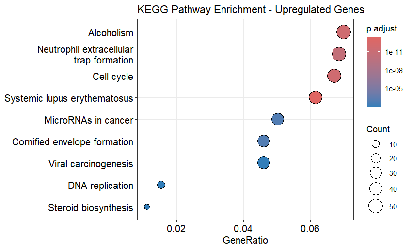
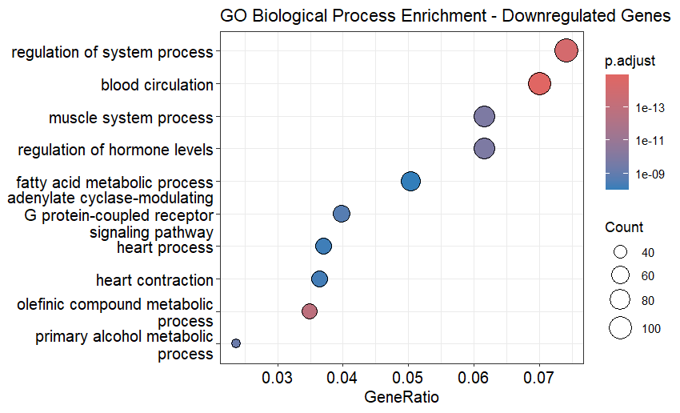
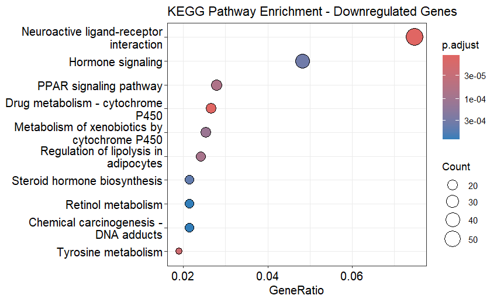
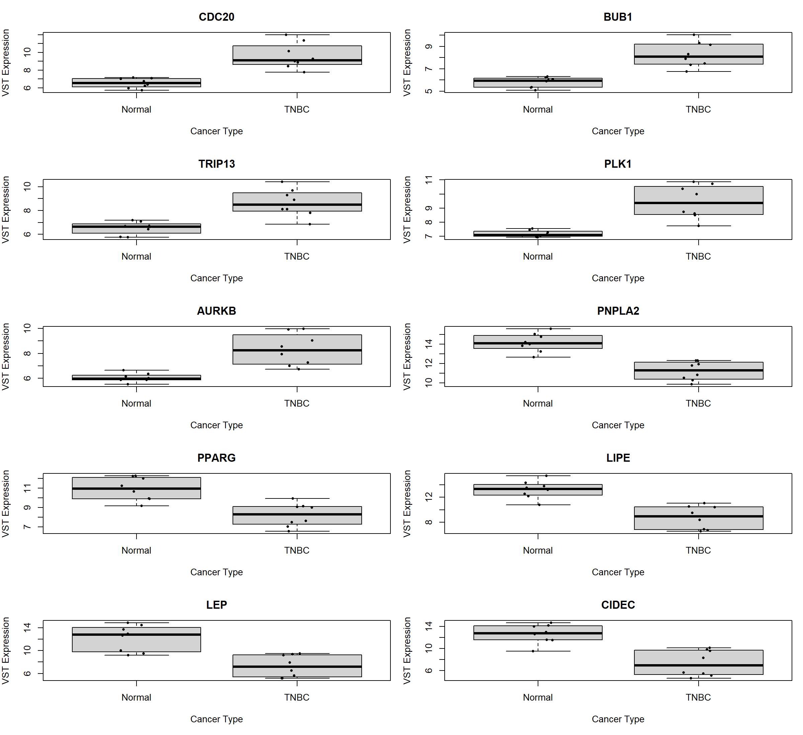
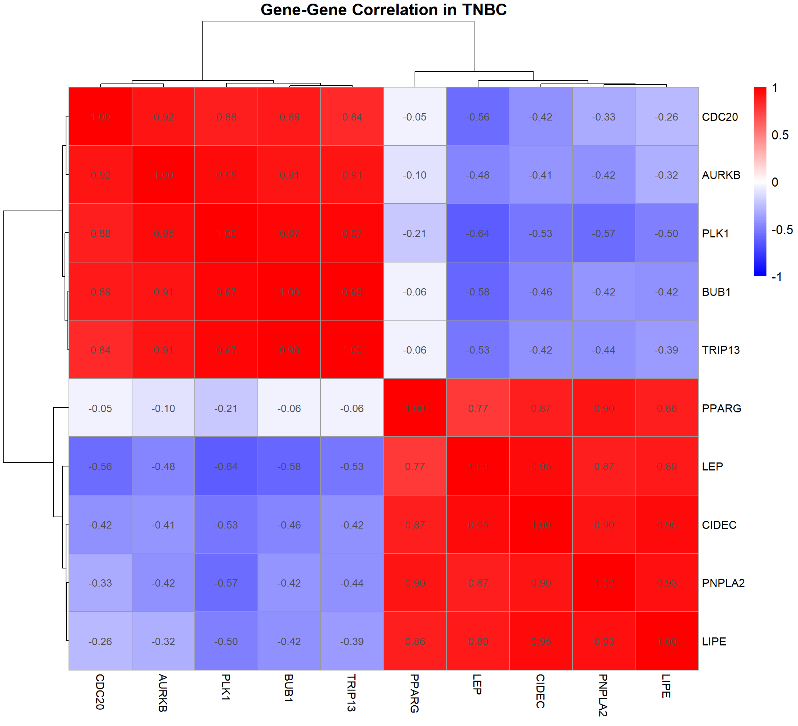
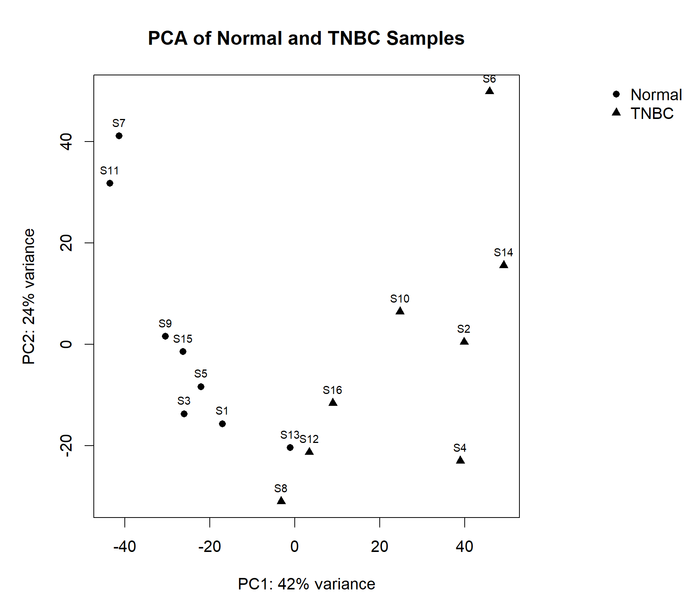

# Transcriptomic Analysis of Triple-Negative Breast Cancer

## Overview

This project presents a reproducible RNA-seq transcriptomic analysis comparing matched Normal breast tissue and triple-negative breast cancer (TNBC) samples.

The analysis aims to identify differentially expressed genes, characterize biological pathways associated with TNBC, and prioritize candidate genes representing distinct molecular programs.

The analysis identified two major transcriptional patterns:

- **Increased cell-cycle and proliferative activity**
- **Reduced lipid-associated and metabolic activity**

---

## Research Question

> What transcriptional and biological pathways distinguish TNBC samples from Normal breast tissue, and which genes can be prioritized as candidate markers of these molecular differences?

---

## Dataset

The analysis used RNA-seq gene expression data from the **NCBI Gene Expression Omnibus (GEO) dataset GSE233242**.

The final analysis included:

- **8 Normal samples**
- **8 TNBC samples**
- **16 samples in total**
- **39,376 genes/features**

The analysis was restricted to matched Normal-TNBC samples.

---

# Analysis Workflow

The analysis was performed using **R** and organized into nine sequential scripts.

```text
01_explore_data.R
        ↓
02_differential_expression.R
        ↓
03_functional_enrichment.R
        ↓
04_candidate_prioritization.R
        ↓
05_candidate_validation.R
        ↓
06_visualization.R
        ↓
07_independent_validation.R
        ↓
08_molecular_signatures.R
        ↓
09_GSEA.R
```

### 1. Data Exploration and Sample Preparation

`Scripts/01_explore_data.R`

- Loaded GEO sample metadata
- Identified Normal and TNBC samples
- Identified matched patients
- Loaded the raw RNA-seq count matrix
- Selected the final 16 samples
- Examined sequencing depth and count distributions

### 2. Differential Expression Analysis

`Scripts/02_differential_expression.R`

Differential expression analysis was performed using **DESeq2**.

The analysis identified:

- **2,011 upregulated genes**
- **2,218 downregulated genes**

### 3. Functional Enrichment

`Scripts/03_functional_enrichment.R`

Functional enrichment analysis was performed using:

- Gene Ontology (GO) Biological Process
- KEGG pathway analysis

Upregulated and downregulated genes were analyzed separately.

### 4. Candidate Gene Prioritization

`Scripts/04_candidate_prioritization.R`

Candidate genes were prioritized using differential expression, statistical significance, pathway association, and biological relevance.

Ten final candidates were selected.

### 5. Candidate Validation

`Scripts/05_candidate_validation.R`

The final candidates were evaluated using:

- Expression-level comparison between Normal and TNBC
- Wilcoxon statistical testing
- Multiple-testing correction
- TNBC-specific Pearson correlation analysis

### 6. Visualization

`Scripts/06_visualization.R`

The analysis generated:

- PCA plot
- Differential-expression volcano plot
- GO enrichment plots
- KEGG enrichment plots
- Candidate-gene heatmap
- Candidate-gene boxplots
- TNBC candidate-gene correlation heatmap

### 7. Independent Validation

`Scripts/07_independent_validation.R`

The final ten-gene candidate panel was evaluated in an independent breast cancer cohort, **GSE52194**, containing:

- **3 Normal samples**
- **5 TNBC samples**

The analysis evaluated expression patterns of the ten candidate genes between Normal and TNBC samples.

The independent cohort was used to assess whether the candidate-gene expression patterns observed in the discovery cohort were also detectable in an external dataset.

The analysis generated an independent validation expression figure and corresponding validation results.

### 8. Molecular Signature Analysis

`Scripts/08_molecular_signatures.R`

The ten candidate genes were organized into two predefined molecular programs:

| Molecular program | Genes |
|---|---|
| Proliferation | **CDC20, BUB1, TRIP13, PLK1, AURKB** |
| Metabolic | **PNPLA2, PPARG, LIPE, LEP, CIDEC** |

Signature scores were calculated for each sample and compared between Normal and TNBC groups using the Wilcoxon rank-sum test.

### Discovery cohort

- Proliferation signature: **p = 0.0009391**
- Metabolic signature: **p = 0.0009391**

### Independent cohort

- Proliferation signature: **p = 0.03689**
- Metabolic signature: **p = 0.03689**

Both molecular programs showed significant differences between Normal and TNBC samples in the independent cohort, supporting replication of the two major transcriptional programs.

### 9. Hallmark Gene Set Enrichment Analysis

`Scripts/09_GSEA.R`

Preranked Gene Set Enrichment Analysis (GSEA) was performed using the **DESeq2 test statistic** as the ranking metric and the **MSigDB Hallmark gene-set collection**.

The analysis included:

- **24,750 ranked genes**
- **50 Hallmark pathways**
- `fgsea` for preranked enrichment analysis

Using an adjusted p-value threshold of **0.05**, the latest analysis identified:

- **12 TNBC-enriched pathways**
- **14 Normal-enriched pathways**
- **26 significant pathways overall**

The strongest TNBC-associated pathways included:

- **G2M Checkpoint**
- **E2F Targets**
- **mTORC1 Signaling**
- **MYC Targets**
- **Glycolysis**
- **Mitotic Spindle**

The strongest Normal-associated pathways included:

- **Adipogenesis**
- **Myogenesis**
- **Fatty Acid Metabolism**
- **Oxidative Phosphorylation**
- **Xenobiotic Metabolism**
- **Bile Acid Metabolism**



---

# Key Findings

## Differential Expression

The analysis identified extensive transcriptional differences between Normal and TNBC samples.

| Category | Number |
|---|---:|
| Genes analyzed | 39,376 |
| Upregulated genes | 2,011 |
| Downregulated genes | 2,218 |

### Volcano Plot



The volcano plot summarizes the magnitude and statistical significance of differential gene expression. The analysis shows a substantial number of significantly upregulated and downregulated genes in TNBC relative to Normal tissue.

---

# Upregulated Molecular Program

The upregulated genes were strongly enriched for processes involving:

- Nuclear division
- Mitotic nuclear division
- Sister chromatid segregation
- Chromosome segregation
- Cell-cycle checkpoint signaling

The strongest GO Biological Process enrichment was:

**Nuclear division — adjusted p-value = 1.63 × 10⁻²²**

The strongest KEGG pathway was:

**Cell cycle — adjusted p-value = 1.15 × 10⁻¹⁴**

Together, these results indicate a strong **proliferative and mitotic transcriptional program** in the TNBC samples.

### Prioritized upregulated genes

- **CDC20**
- **BUB1**
- **TRIP13**
- **PLK1**
- **AURKB**

### GO Biological Process — Upregulated Genes



### KEGG Pathway Enrichment — Upregulated Genes



---

# Downregulated Molecular Program

Downregulated genes were enriched for metabolic, hormonal, and lipid-associated processes.

Important biological processes included:

- Fatty acid metabolic process
- Regulation of hormone levels
- Adaptive thermogenesis
- Retinol metabolism
- Muscle-related processes
- Circulatory and vascular processes

KEGG analysis showed enrichment of pathways including:

- PPAR signaling
- Regulation of lipolysis in adipocytes
- Steroid hormone biosynthesis
- Retinol metabolism
- Fatty acid degradation
- Adipocytokine signaling

The strongest reported metabolic pathway associations included:

**PPAR signaling — adjusted p-value = 2.58 × 10⁻⁵**

**Regulation of lipolysis in adipocytes — adjusted p-value = 2.58 × 10⁻⁵**

These findings suggest altered **lipid-associated and metabolic transcriptional programs** in TNBC.

### Prioritized downregulated genes

- **PNPLA2**
- **PPARG**
- **LIPE**
- **LEP**
- **CIDEC**

### GO Biological Process — Downregulated Genes



### KEGG Pathway Enrichment — Downregulated Genes



---

# Key Biological Interpretation

Taken together, the results suggest that the TNBC transcriptional state examined in this cohort is characterized by two major molecular programs:

### 1. Increased proliferation

The upregulated gene set was strongly associated with:

- Mitotic nuclear division
- Chromosome segregation
- Sister chromatid segregation
- Cell-cycle checkpoint signaling
- Cell-cycle pathway activity

The prioritized genes **CDC20, BUB1, TRIP13, PLK1, and AURKB** represent the proliferation-associated component of the candidate panel.

### 2. Reduced lipid-associated metabolism

The downregulated gene set showed strong enrichment for:

- Fatty acid metabolism
- Lipid-associated processes
- Hormone regulation
- PPAR signaling
- Lipolysis
- Steroid and retinol metabolism

The prioritized genes **PNPLA2, PPARG, LIPE, LEP, and CIDEC** represent the metabolic-associated component.

Together, these findings support a model in which the analyzed TNBC samples exhibit increased proliferative activity alongside reduced lipid-associated metabolic activity.

A more detailed biological interpretation is provided in:

`Interpretation/biological_interpretation.md`

---

# Final 10-Gene Candidate Panel

The final candidate panel consists of two major molecular groups:

| Molecular program | Candidate genes |
|---|---|
| Proliferation / mitosis | **CDC20, BUB1, TRIP13, PLK1, AURKB** |
| Lipid / metabolic | **PNPLA2, PPARG, LIPE, LEP, CIDEC** |

The candidates showed significant expression differences between Normal and TNBC samples after multiple-testing correction.

## Candidate Gene Expression

### Heatmap


The heatmap shows the relative expression patterns of the ten prioritized candidates across the analyzed samples.

### Boxplots



The boxplots provide gene-level comparisons of expression between Normal and TNBC samples.

---

# TNBC-Specific Correlation Analysis

Correlation analysis among the ten candidates was performed using the **eight TNBC samples**.

Several proliferation-associated genes showed strong positive correlations:

- **BUB1–TRIP13:** r = 0.98
- **TRIP13–PLK1:** r = 0.97
- **PLK1–AURKB:** r = 0.95

Several metabolic-associated genes also showed strong positive correlations:

- **LIPE–CIDEC:** r = 0.95
- **LEP–CIDEC:** r = 0.95
- **PNPLA2–LIPE:** r = 0.93

Several relationships between the proliferation-associated and metabolic-associated genes were negative.

### Correlation Heatmap



These correlations provide exploratory evidence that the prioritized genes may form coordinated expression programs within the TNBC samples.

---

# PCA and Sample-Level Exploration

### PCA



The PCA provides an overview of global transcriptomic variation among the analyzed samples and helps visualize the overall structure of the Normal and TNBC expression profiles.

---

# Results

The `Results/` directory contains:

- Complete DESeq2 results
- Upregulated and downregulated gene lists
- Annotated DEGs
- GO enrichment results
- KEGG enrichment results
- Candidate-gene prioritization results
- Final ten-gene shortlist
- Statistical validation results
- TNBC correlation matrix
- Independent validation results
- Molecular signature scores and statistical tests
- Hallmark GSEA results
- TNBC-enriched and Normal-enriched GSEA pathways

---

# Project Structure

```text
tnbc-transcriptomic-analysis/
│
├── Data/
│   ├── Raw data
│   └── GSEA/
│       └── h.all.v2026.1.Hs.symbols.gmt
│
├── Scripts/
│   ├── 01_explore_data.R
│   ├── 02_differential_expression.R
│   ├── 03_functional_enrichment.R
│   ├── 04_candidate_prioritization.R
│   ├── 05_candidate_validation.R
│   ├── 06_visualization.R
│   ├── 07_independent_validation.R
│   ├── 08_molecular_signatures.R
│   └── 09_GSEA.R
│
├── Results/
│   ├── Analysis result tables
│   ├── Molecular_Signatures/
│   └── GSEA/
│
├── Figures/
│   ├── Analysis visualizations
│   ├── Molecular_Signatures/
│   └── GSEA/
│
├── Interpretation/
│   └── biological_interpretation.md
│
├── README.md
├── .gitignore
└── Breast Cancer transcriptomics.Rproj
```

---

# Reproducibility

The analysis is organized into sequential R scripts that should be executed in the following order:

```text
01_explore_data.R
        ↓
02_differential_expression.R
        ↓
03_functional_enrichment.R
        ↓
04_candidate_prioritization.R
        ↓
05_candidate_validation.R
        ↓
06_visualization.R
        ↓
07_independent_validation.R
        ↓
08_molecular_signatures.R
        ↓
09_GSEA.R
```

The project uses **GSE233242** as the source dataset.

The analysis was performed in R using packages including:

- DESeq2
- pheatmap
- clusterProfiler
- org.Hs.eg.db
- fgsea

Raw sequencing/count data are excluded from Git tracking where appropriate using `.gitignore`.

---

# Limitations

1. The final analysis included only **16 samples: 8 Normal and 8 TNBC**.
2. The analysis identifies transcriptomic associations and does not establish causal relationships.
3. Independent validation was performed using GSE52194, but the validation cohort was small (3 Normal and 5 TNBC samples).
4. TNBC-specific correlation analysis was based on only eight TNBC samples and should therefore be considered exploratory.
5. The ten genes should be considered **candidate markers rather than clinically validated biomarkers**.
6. Independent validation using larger cohorts and experimental studies is required.
7. The candidate panel should be considered hypothesis-generating rather than a clinically established molecular signature.

---

# Conclusion

This transcriptomic analysis identified extensive molecular differences between Normal and TNBC breast tissue.

The results consistently highlighted two major transcriptional programs:

**Enhanced cell-cycle and proliferative activity**

and

**Reduced lipid-associated and metabolic activity.**

The prioritized ten-gene panel captures both components:

**CDC20, BUB1, TRIP13, PLK1, AURKB, PNPLA2, PPARG, LIPE, LEP, and CIDEC.**

These genes and associated pathways provide a biologically coherent set of candidates for further investigation and independent validation.

The analysis is intended as a **computational and hypothesis-generating study**, rather than a clinical biomarker validation study. Independent validation and molecular signature analysis further supported the distinction between the proliferation-associated and lipid/metabolic programs.

Hallmark GSEA provided pathway-level evidence consistent with these findings, with cell-cycle, E2F, MYC, mTORC1, glycolytic, and mitotic programs enriched toward TNBC, while adipogenic and lipid/metabolic programs were enriched toward Normal tissue.

Together, these analyses provide a multi-level computational framework connecting differential expression, candidate-gene prioritization, independent validation, molecular signatures, and pathway-level enrichment.
